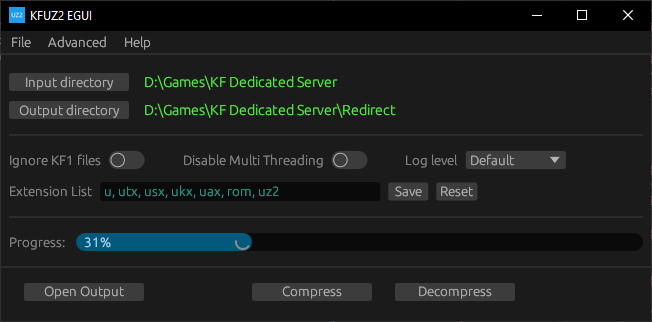

[build_badge]: https://img.shields.io/github/actions/workflow/status/InsultingPros/KFRedirectTool/build.yml?style=for-the-badge
[release_badge]: https://img.shields.io/github/downloads/InsultingPros/KFRedirectTool/total?style=for-the-badge

# KF UZ2 Egui

[![build_badge]](https://github.com/InsultingPros/KFRedirectTool/actions/workflows/build.yml) [![release_badge]](https://github.com/InsultingPros/KFRedirectTool/releases)

> [Go back to README](../../README.md)

Allows to compress whole directories and do it **fast**.

