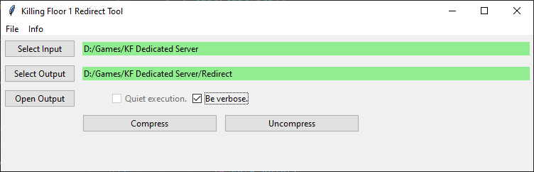

[release]: https://github.com/InsultingPros/KFRedirectTool/releases

# Tkinter GUI for `KFUZ2`

First step: install [Python >3.10.x](https://www.python.org/) and download the latest [release].

- Run the **tkinterGUI.py**.
- Choose `Input` folder, which contains game packages.
  - You can compress the whole server at once, btw, it will omit vanilla packages.
- Choose `Output` folder if you want everything to be collected in one place. Else, new files will be created near originals.
- Press `compress` / `decompress` buttons, depending on what you want.
- Check the progress in the console.
- Done!

Supported operating systems: Windows, Linux, MacOS.

## Credits

- [dkanus](https://github.com/dkanus) - for helping me with dumb questions.
- [Vel](https://github.com/Vel-San) - for helping with python formatting, code enhancements.
